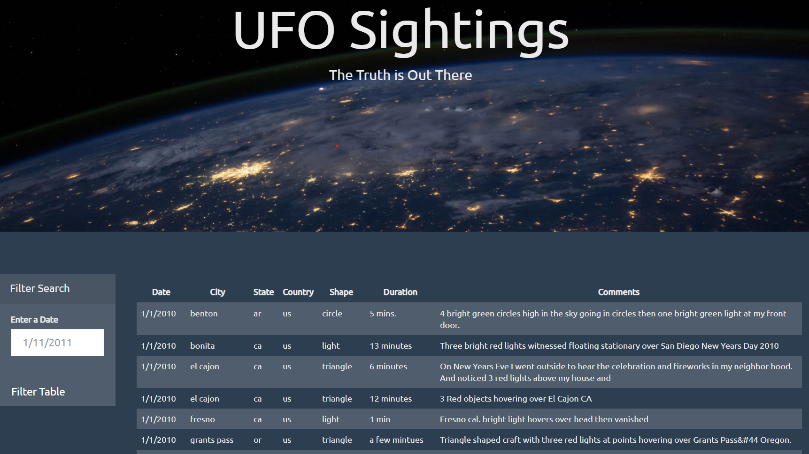
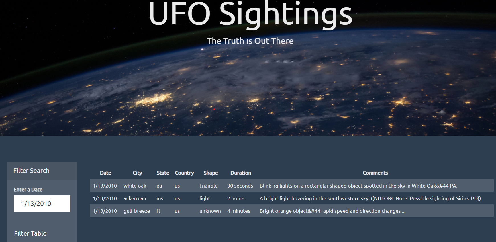
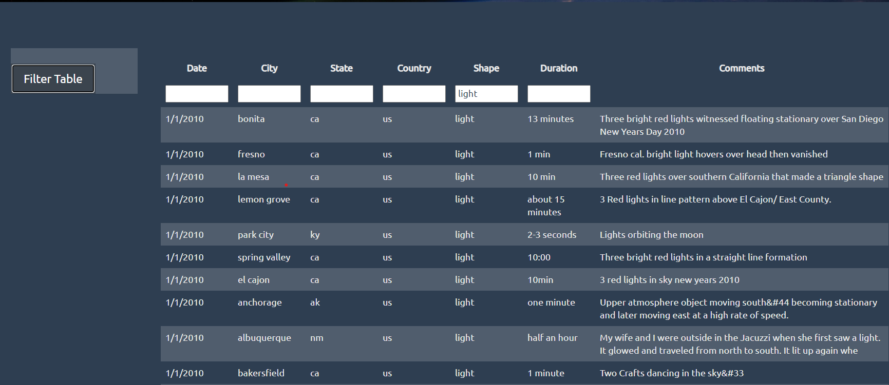

# Data Analytics javascript-challenge

## UFO Sightings

For this challenge, a web-page was created which contains a table listing details from UFO sightings for 1/1/2010 - 1/13/2010.  Within the UFO-level-1 folder, the table can be filtered for UFO sightings by date.

**UFO-level-1:** 

Download all the files in the UFO-level-1 folder.  Open up the index.html file in a browser and the page should display a table of UFO sightings with columns for date, city, state, country, shape of the ufo, duration of the encounter, and comments regarding the encounter.  To filter the table based on the encounter date, enter a date between 1/1/2010 - 1/13/2010 (*be sure to format your dates as listed!*) to filter the ufo sightings table by date.

After entering in a valid date, the webpage should look like this:

**UFO-level-2:**
Download all the files in the UFO-level-2 folder.  Open up the index.html file in a browser and the page should display a table of UFO sightings with columns for date, city, state, country, shape of the ufo, duration of the encounter, and comments regarding the encounter.  The table can be filtered by date, city, state and shape, by typing in filter criteria into the appropriate input box for each column.

After entering in a valid search term, a filtered table should be returned like this:

